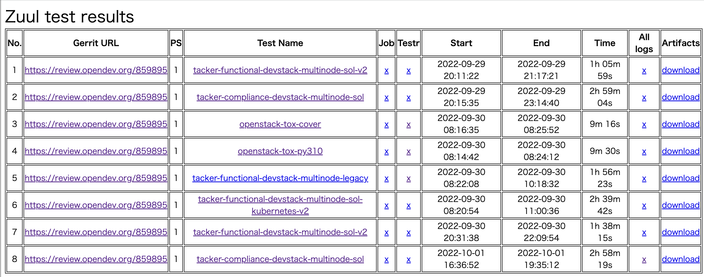
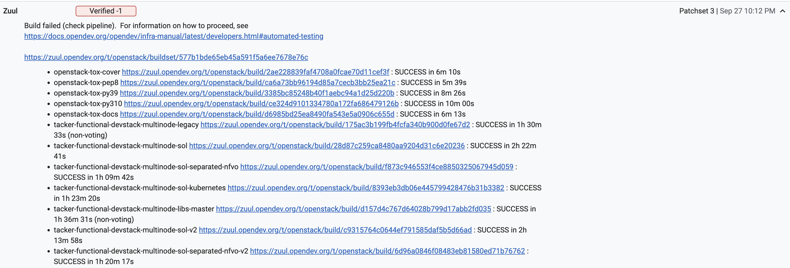
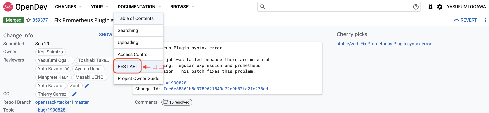
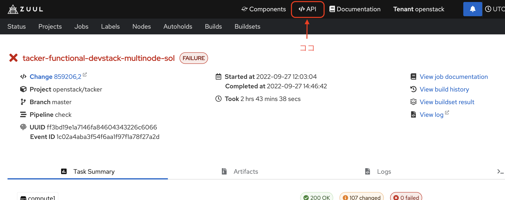

# Zuul Log Analyzer

A util tool for collecting results of Openstack Zuul gate tests.

## これは何

Zuulからテスト結果を抽出、参照するための簡易ツールです。
現在のところ、テスト結果がFAILUREとなったものだけを抽出します。
またログファイルを取得するためのサポートツールも提供しています。

複数の出力形式をサポートしており、例えばhtmlとして出力する場合は
以下の様にします。

```sh
$ python3 zuul_client.py -o results.html --change-ids 859895
```

コマンドにより生成された`results.html`を開くと、`--change-ids`で
指定されたパッチにおいて`FAILURE`となった全てのテスト結果の一覧が表示されている
ことがわかります。



ログファイルの取得は以下のようにして行います。
`all_logs.py`は指定したchange IDのコミットの`FAILURE`となった全てのログを
取得するためのツールです。
通常はログが大量となるため、パッチセットを指定して次のように実行します。
パッチセットを省略した場合は当該Change IDの全てのログを取得します。

```sh
$ python3 all_logs.py -i 859895 -p 3
```

この`all_logs.py`は内部で`get_logs.sh`というスクリプトを実行しており、
これはZuulの`Artifacts`から参照できる
`Download all logs`のリンク先にあるダウンロードスクリプトを実行するための
簡易スクリプトで、これを直接実行して目的のログを取得することもできます。
`DOWNLOAD_SCRIPT_URL`がダウンロードスクリプトのURLになります。

```sh
$ bash get_logs.sh DOWNLOAD_SCRIPT_URL
```

この`get_logs.sh`はカレントディレクトリに`tmp`ディレクトリを作成し、その配下に
ログファイルをダウンロードして格納します。

## 使い方

ログ解析したいパッチ（gerritやzuulでは`change`と言うため以降そう呼びます）
を指定してテスト結果の一覧を取得します。

`change`の指定方法は2通りあります。1つはgerritのURLに付与される数値IDで、
もう一つが`change`をアップロードする際にコミットメッセージに追加される
`Change-Id`です。

数値IDは例えば次のgerritのURLの末尾にある`859260`です。
- https://review.opendev.org/c/openstack/tacker/+/859260

また`Change-Id`は以下のようなコミットメッセージに追記される
`Id584a41fc7ae64a682d6dd390a38913e2c7e655b`のようなIDです。

```
Support multi artifact of ansible driver

The Ansible driver can only run specific script files.
Due to multi artifact support of mgmt driver, it will be extended to
specify script files to be executed in each life cycle.

Implements: blueprint add-ansible-mgmt-driver-sample
Change-Id: Id584a41fc7ae64a682d6dd390a38913e2c7e655b
```

`change`は一度に複数指定することができます。
コマンドラインから一つ一つ与えられますが、数が多い場合はファイルに列挙して
それを指定することも出来ます。

コマンドラインから複数の`change`を直接指定する場合はそれらのIDを空白区切りで
指定します。

```sh
$ python3 zuul_client.py -o results.html --change-ids 859895 859377 859206
```

またファイルとして指定する場合は`--change-ids`の代わりに
`--change-ids-file`を用います。

```sh
$ python3 zuul_client.py -o results.html --change-ids-file my-cids.txt
```

この`--change-ids-file`で指定するファイルではコメントアウトをサポートしています。
`#`から始まる行は無視され、以下の例では2番目のIDが無視されます。

```
859895
#859377
859206
```

前章の例では出力先を指定する`-o`オプションを用いてhtmlファイルとして
出力しましたが、その他に複数の形式をサポートしており、
`-f`オプションにて指定することが出来ます。
また`-o`を使わない場合は標準出力に結果を表示します。

- html
- csv
- json

なお`json`とその他の形式では出力される情報量が異なります。
`json`は後で説明するZuul APIで取得した情報をほぼ全て出力するため、
より詳細な解析に使えますが、通常は`html`もしくは`csv`で十分です。

`html`で出力される情報は以下の通りです
(`csv`では一部表示は異なるが情報量は同じ)。

- No.: 通番
- Gerrit URL: gerritのパッチへのリンク
- PS: patch setの通番
- Test Name: Zuulのテスト結果へのリンク
- Job: テストログに含まれる`job-output.txt`へのリンク
- Testr: Unit Test Reportへのリンク（一部Functional testもある）
- Start: テスト開始時刻
- End: テスト終了時刻
- Time: テスト所要時間
- All Logs: 全ログファイルのトップディレクトリへのリンク 
- Artifacts: 全ログファイルをダウンロードする`download-logs.sh`へのリンク

Zuulのログファイルはある日突然消え去ります。
一つ一つのテストにより生成されるログは膨大なため、最低限の情報を残し
過去のファイルはどんどん消去されるためです。
もしログファイルが残ったテスト結果だけを抽出したい場合には、
最近のログのみに絞って結果を取得する必要があります。
つまり`-t`もしくは`--term`により過去どの位遡ってログを取得するのかを指定します。
指定する時間の単位は時間`[hour]`、`"`で括ることで計算出来ることに
注目してください（小数点以下は切り捨て）。

```sh
$ python3 zuul_client.py \
    -o results.html --change-ids-file my-cids.txt \
    -t "24*3"  # 過去3日
```

### コマンドオプション

詳細はヘルプ`-h`を参照してください。

```sh
$ python3 zuul_client.py -h
usage: zuul_client.py [-h] [-f FORMAT] [--change-ids CHANGE_IDS [CHANGE_IDS ...]]
                      [-i CHANGE_IDS_FILE] [-o OUTPUT_FILE] [-t TERM]
                      [--input-json INPUT_JSON]

options:
  -h, --help            show this help message and exit
  -f FORMAT, --format FORMAT
                        Output format
  --change-ids CHANGE_IDS [CHANGE_IDS ...]
                        List of change IDs
  -i CHANGE_IDS_FILE, --change-ids-file CHANGE_IDS_FILE
                        Input file include a list of change IDs
  -o OUTPUT_FILE, --output-file OUTPUT_FILE
                        Path of output file.
  -t TERM, --term TERM  Term for querying (in hours, such as '24*2' for two days).
  --input-json INPUT_JSON
                        Path of JSON formatted results, for debugging.
```

## 仕組み

このツールではZuulのテスト結果を取得するために2つのREST APIを使用しています。
1つ目はGerrit APIで、テスト結果の一覧とZuulへのリンクを取得するのに利用します。
もう一つはZuul APIで、テスト結果の詳細やログファイルへのリンクを取得します。

### Gerrit API

テスト結果の一覧はGerritレビューのテスト結果より参照できます。



このテスト結果を含む`change`の情報はGerrit APIからJSONデータとして
取得する事ができ、上の様なZuulの結果は
[Get Change Message](https://review.opendev.org/Documentation/rest-api-changes.html#get-change-message)
APIより取得します。

```
GET /changes/{change-id}/messages/{change-message-id}
```

このAPIの戻り値として得られるJSONデータからテスト結果（`SUCESS`, `FAILURE`）
とZuulへのリンクを抽出することで、次のZuul APIにおいて使用するパラメータを
取り出します。

Gerrit APIの詳細に関しては以下のリンクよりドキュメントを参照してください。


### Zuul API

Zuul APIでは現在動作しているjobの一覧や過去のテスト結果の詳細などに関する
情報を取得することが出来ます。
このツールでは
[builds](https://zuul.opendev.org/openapi) APIを利用してテスト結果を取得します。

```
GET /api/tenant/{tenant}/builds
```

Zuulではテスト結果を一意に特定するためにUUIDを用いています。この値は先ほどの
Gerrit APIから取得できるため、これをクエリに含めることで結果を取得します。
具体的には次の様に指定します。

```
GET /api/tenant/{tenant}/builds?uuid=UUID
```

このツールの出力に含まれるログファイルなどへのリンクはこのAPIの戻り値に
含まれます。

Zuul APIの詳細に関しては以下のリンクよりドキュメントを参照してください。

